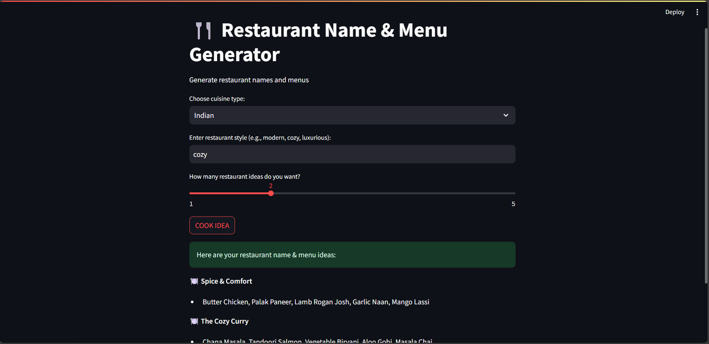

# 🍴 Restaurant Name Generator

A fun Python-based project that generates creative and unique restaurant names using **AI/ML models** and **randomized techniques**.  
This project is useful for entrepreneurs, developers, and anyone brainstorming new brand ideas.

---

## 🚀 Features
- Generates unique restaurant names automatically  
- Supports multiple styles of names (trendy, classic, funny, modern, etc.)  
- Ensures no repetition for better creativity  
- Easy-to-use command-line interface  
- Extendable for web or chatbot integration  

---

## 📂 Project Structure
RestaurantNameGenerator/
│── main.py # Main script to run the generator
│── generator.py # Core logic for name generation
│── secret_key.py # API key handler (excluded from repo)
│── requirements.txt # Python dependencies
│── README.md # Project documentation
│── pycache/ # Cache files (ignored)

---

## ⚙️ Installation & Usage

### 1. Clone the repository
git clone https://github.com/tanisha1407/RestaurantNameGenerator.git
cd RestaurantNameGenerator

### 2. Create a virtual environment (optional but recommended)

python -m venv venv
source venv/bin/activate   # For Linux/Mac
venv\Scripts\activate      # For Windows

### 3. Install dependencies
pip install -r requirements.txt

### 4. Run the program
python main.py

## 🛡️ Security Notes

secret_key.py is not included in the repo for security reasons.

Add your API key manually in a secret_key.py file like this:

API_KEY = "your_api_key_here"

## App Screenshot:

## 🤝 Contributing

Pull requests are welcome! For major changes, please open an issue first to discuss what you’d like to improve.

## 📜 License

This project is licensed under the MIT License – feel free to use and modify it.
